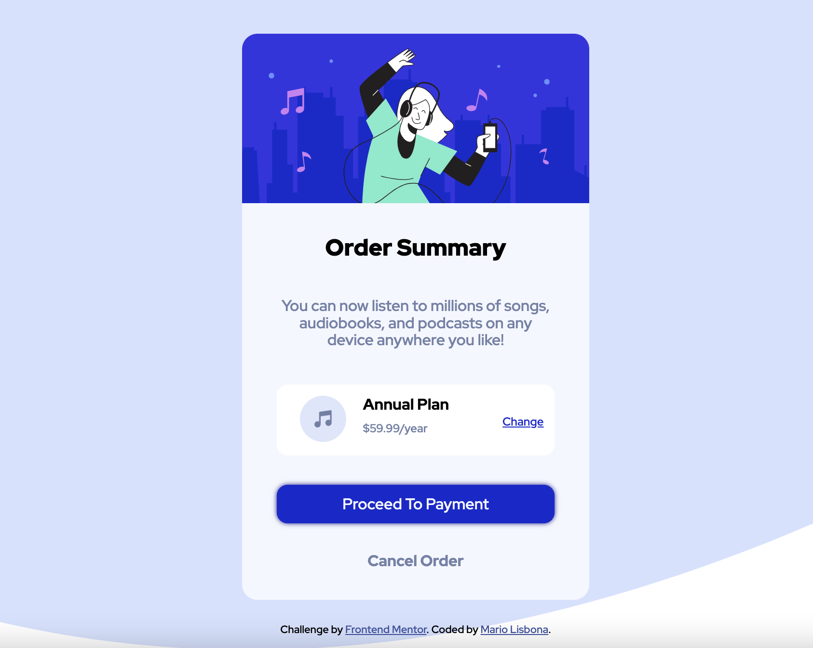
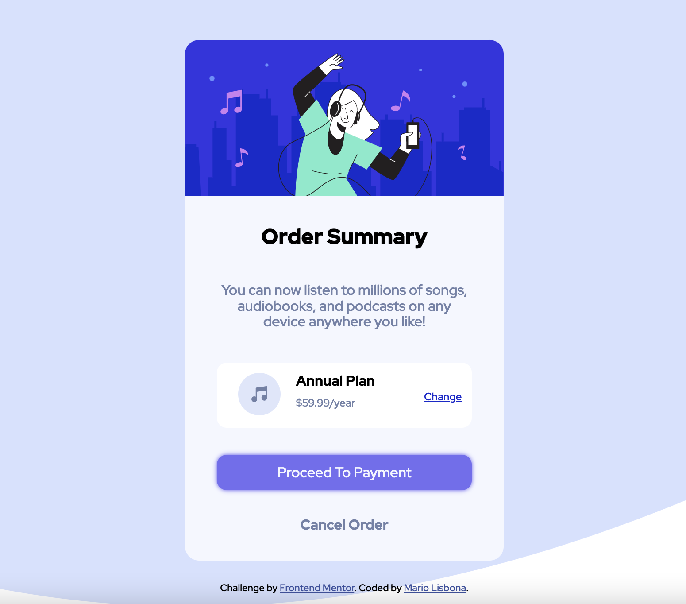
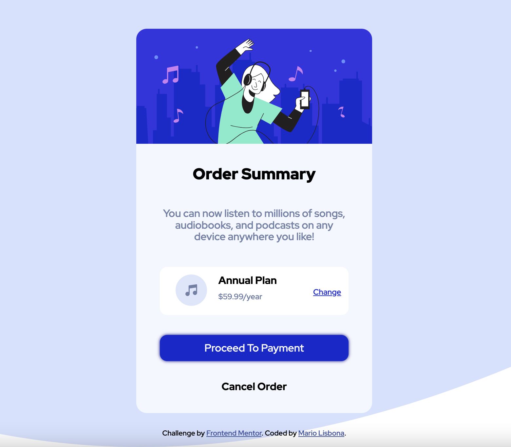

# Frontend Mentor - Order summary card solution

This is a solution to the [Order summary card challenge on Frontend Mentor](https://www.frontendmentor.io/challenges/order-summary-component-QlPmajDUj). Frontend Mentor challenges help you improve your coding skills by building realistic projects. 

## Table of contents

- [Overview](#overview)
  - [The challenge](#the-challenge)
  - [Screenshot](#screenshot)
  - [Links](#links)
- [My process](#my-process)
  - [Built with](#built-with)
  - [What I learned](#what-i-learned)
  - [Continued development](#continued-development)
  - [Useful resources](#useful-resources)
- [Author](#author)

**Note: Delete this note and update the table of contents based on what sections you keep.**

## Overview

### The challenge

Users should be able to:

- See hover states for interactive elements

### Screenshot

### Links

- Solution URL: [Add solution URL here](https://github.com/MarioLisbona/FEM-order-summary-component)
- Live Site URL: [Add live site URL here](https://mariolisbona.github.io/FEM-order-summary-component/)

## My process

I started by setting some root variables for colors, then set * to box-sizing: border-box. I also removed the margins from h1, h2, h3 and p.

I then set the body attributes so that the container would be in the center of the page.

Then i setup the main container with div's for the hero image, title, information, payment button and cancel button.
The payment-plan info is another container and its children are setup with CSS Grid.

I set the footer provided by Frontend Mentor at the bottom of the page with the style positionL: absoulte.

Once i had styled everything correctly i styled the hover states for teh payment button and cancel button.

I finished by adjusting a few styles for a mobile responsive layout.

### Built with

- Semantic HTML5 markup
- CSS custom properties
- Flexbox
- CSS Grid
- SVG image converter

### What I learned

I had never used SVG's before and was having trouble putting them into the html. The background was not letting me center the order-summary container with flex-box. I decided to not waste time on it and find a way to convert the <svg> tag to an image i could download.

I later realised i had messed up and left a 
 tag loose at the top of my HTML doc so this is probably what was causing the issue of alot of whitespace above the container.

### Continued development

I will try again in another project to use the <svg> tags and info rather than converting and downloading an image to store locally.

### Useful resources

- [Example resource 1](https://jakearchibald.github.io/svgomg/) - This site allows you to paste the SVG markup and download an image.
- [Example resource 2](https://css-tricks.com/snippets/css/complete-guide-grid/) - I hadnt used CSS grid in a while so this helped refresh my memory.

## Author

- Frontend Mentor - [@MarioLisbona](https://www.frontendmentor.io/profile/MarioLisbona)

